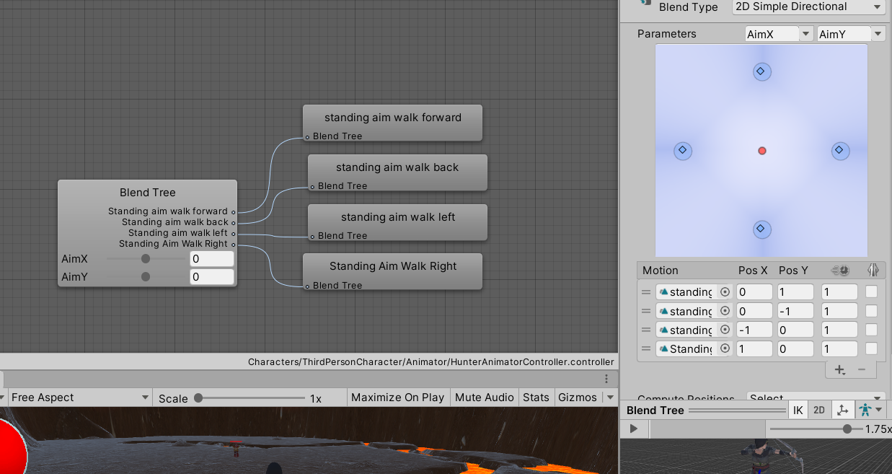

# First-Game
3D角色扮演遊戲
滑鼠左鍵:攻擊;空白鍵:跳躍;WASD控制移動;TAB選單
## 目錄
* [遊戲Demo](#遊戲Demo)
* [介紹](#介紹)
* [參考資料](#參考資料)
* [未實現功能](#未實現功能)
* [聯繫](#聯繫)
## 遊戲Demo  
https://youtu.be/nAZyKmvDEOE
## 介紹
* 由課程內容去修改和增加基本遊戲內容
* 製作第三人稱的弓箭手
* 套入自製場景測試
## 參考資料
* 顯示傷害 
[程式連結](./Scripts/MagicAI/GetDamage.cs) 
參考:https://cindyalex.pixnet.net/blog/post/251373467-unity-c%23-%E5%82%B7%E5%AE%B3%E5%AD%97%E9%AB%94%E5%91%88%E7%8F%BE%E6%95%99%E5%AD%B8 
* Blend Tree應用瞄準移動 

參考:https://www.bilibili.com/video/BV1q4411G79y?from=search&seid=7269624033905667997 
* 弓箭手攻擊 
官方教程:https://www.youtube.com/watch?v=537B1kJp9YQ&t=357s 
[弓箭手程式連結](./Scripts/Hunter/) 
* 技能冷卻 
[程式連結](./Scripts/Warrior/SkillIitem.cs) 
參考:https://www.youtube.com/watch?v=uF7ypBJ1biE&list=WL&index=12&t=255s 
* 腳步聲 
參考:https://www.youtube.com/watch?v=Bnm8mzxnwP8 
* 場景讀取 
[程式連結](./Scripts/Game/GameButton.cs) 
參考:https://jerrard-liu.blogspot.com/2015/06/LoadingScreen.html 
角色創建 
[程式連結](./Scripts/Game/CreateCharacter.cs)
## 未實現功能
1.背包
2.掉落道具
3.經驗值和等級
## 聯繫
see0864792888@gmail.com
